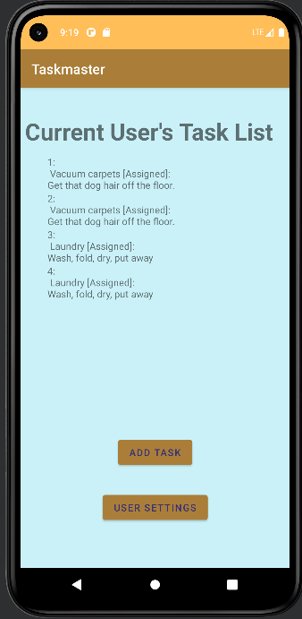
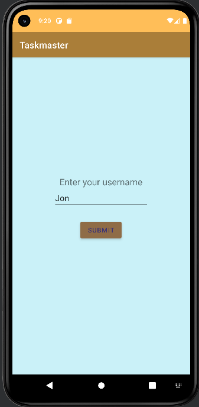
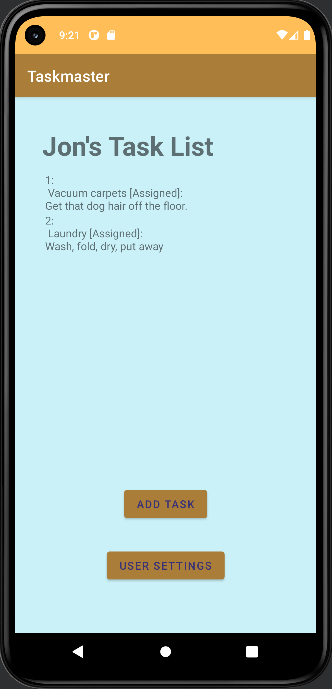
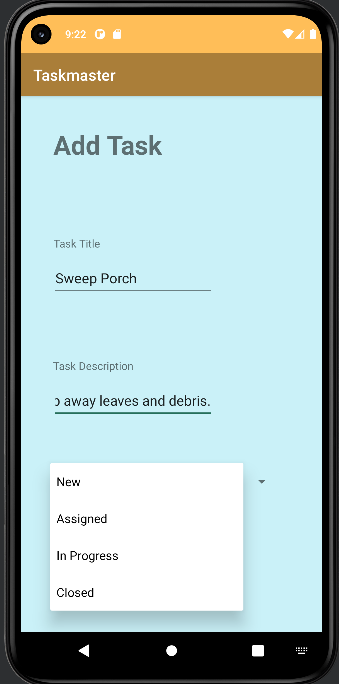
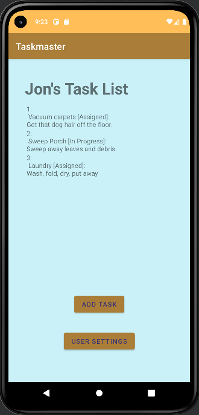
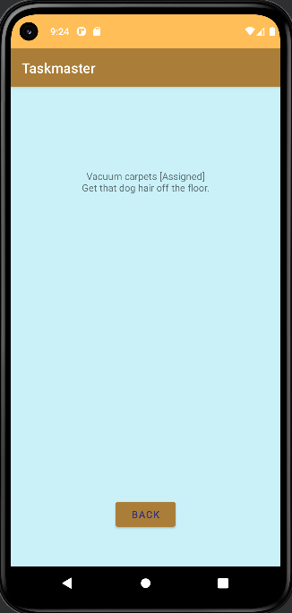

# Taskmaster

## Daily Change Log

Weds and Thurs, June 23 and 24:

- Implemented Homepage, Add a Task, and All Tasks Activities. 
- Configured layout of all three Activities. 
- Enabled button-based navigation and retained back-button functionality. 
- Added styling.

Saturday 25-June:

- Implemented TaskModel to carry data.
- Added RecyclerView on AllTasks Activity.
- Added Spinner element to show hard-coded tasks in a list.

Monday 27-June:

- Set up Room.
- Refactored RecyclerView.
- Modified AddTask to utilize local DB.
- Set up Details Page to show Task Description and Title.

Tuesday 28-June:

- Completed Room DB integration.
- Updated style and added a background.
- Added 4 new Espresso Tests.
- Added unittests.
- Fixed back-button functionality.
- Added ability to destroy certain Activities after work is completed using built-in 'finish()' method.

Wednesday 29-June:

- Removed references to Room and previous Entity and Model "TaskModel".
- Created a Task Resource using AWS Amplify CLI.
- Refactored DB references to use AWS Amplify data instead of Room.
- Modified Add Task Activity to save Task Data to DynamoDB.
- Refactored HomeActivity RecyclerView to display DynamoDB entries.
- Encapsulated Activities with entry-point Class "TaskMasterApplication".
- Espresso Tests were not changed, and still operate.
- Added screenshots of progress to this readme.

Thursday 30-June:

- Added Team model and implemented Bi-directional 'has many' relationship.
- Added 3 Teams (hard coded for now) via mutations.
- Deleted the AllTasks Activity (was not longer in use).
- Added Spinner to select a Team on the AddTask Activity (In progress).

Saturday 2-July:

- Debugged adding Team to a Task, now functional and DB-backed.

Tuesday 5-July:

- Debugged app, updated comments to comment strings, removed some dead code, validated functionality.
- Working through publication steps...

## Feature Tasks

Feature Tasks are broken down into the following sub sections.

### Publishing App to GoogleStore

- [X] Get GoogleDev account.
- [X] Update app-level build.gradle with new package-ID (in this case 'example' to 'jrmz').
- [X] Update 'package=' value in AndroidManifest.xml.
- [X] Update package imports and debug code until package references to your new package name are resolved (see next subsection).
- [X] Name the app "Jon Rumsey's TaskMaster" 
- [X] Configured app as "Free", which cannot be changed to "Paid".
- [X] There is no restricted content, Malware, Intellectual Property, or MUS in this app.
- [X] Early Internal Testing was NOT configured.
- [X] Users must be aged 18 or older.
- [X] The app collects a sample name but has no registration requirement.
- [X] 

#### A Note About setContentView Method Errors on Rename

Highlight 'R', select 'More Action...', select 'Import Class (com.your_name_space.your_project_name)'.

If 'your_name_space' and/or 'your_project_name' do not appear as importable package statements, 
then you'll need to resolve errors in 'setContentView()' method calls:

1. Sync project with Gradle files and check for errors (recurring task). 
2. Build the project again and look for more 'setContentView()' errors and any others (recurring task).
3. Reload AndroidStudio.
4. Repeat all above steps.

### Homepage

- [X] Create a Homepage.
- [X] The main page should be built out to match the wireframe.
- [X] Should have a heading at the top of the page, an image to mock the “my tasks” view.
- [X] Should have buttons at the bottom of the page.
- [X] Should allow going to the “add tasks” and “all tasks” page.
- [X] Create a Task Detail page. It should have a title at the top of the page, and a Lorem Ipsum description.
- [X] Create a Settings page. It should allow users to enter their username and hit save.
- [X] The main page should be modified to contain three different buttons with hardcoded task titles. When a user taps one of the titles, it should go to the Task Detail page, and the title at the top of the page should match the task title that was tapped on the previous page.
- [X] The homepage should also contain a button to visit the Settings page, and once the user has entered their username, it should display “{username}’s tasks” above the three task buttons.
- [X] Refactor home page to use a RecyclerView for displaying Task data. Will be hard-coded data for now.
- [X] Implement a Task Class with "States" for the tasks i.e.: "New", "Assigned", "In Progress", or "Complete".
- [X] Implement a ViewAdapter class to display data from list of Tasks
- [X] Create at least 3 hard-coded tasks in ~~MainActivity~~ HomeActivity.
- [X] A tapped task in RecyclerView will launch the ~~DetailPage~~ TaskDetailActivity with the correct Task Title displayed.
- [X] Refactor RecyclerView to display all Task Entities in the Database.

### Add a Task

- [X] The “Add a Task” page allows users to type in details about a new task.
- [X] Must show a title and a body.
- [X] When users click the “submit” button, show a “submitted!” label on the page.
- [X] Modify Add Task Form to save data entered as a Task in the local database.
- [X] Add a Spinner to select a Team to assign/associate a Task to.

### All Tasks

- [X] The 'all tasks' page should just be an image with a back button; it needs no functionality.

### Details Tasks

- [X] Ensure the description and status of a tapped task are also displayed on the detail page.
- [X] Ensure the Title is still displayed.
- [X] ~~Decide whether to pass the entire Entity or to~~ only pass ~~an ID~~ using an Intent.

### Implementing Room For Data Management

- [X] Set up Room in the App and modify the Task Class to be an Entity.

### Styling and Stretch Goals

Stretch goals:

- [X] Decide on a color scheme.
- [X] Decide font families. For now will stick with the built-in Android font-families.
- [X] Allow the user to specify on their settings page how many tasks should be shown on the homepage. Use this to dynamically create buttons for as many tasks as the user requests.
- [X] Also display the description of the task rather than Lorem Ipsum text.

## Screenshots

### Latest Updates

AWS Amplify-connected Implementation:

Homepage:

User Settings - Change User Name:

Homepage - User Name Sticks:

Add Task - Spinner With Task Status Selections:

Homepage - Updated After Adding A Task (note the status is included):

Task Detail - Task Detail with Status (as assigned):

### Previous Updates In Descending Order

## Tests

- [X] Write unittests for any custom methods built.

*From hereon out* utilize Espresso Tests to validate functionality.

Link to [Unittest Tests Package](./app/src/test/java/com/example/taskmaster/TaskmasterUnitTests.java)

Link to [Espresso Tests Package](./app/src/androidTest/java/com/example/taskmaster/HomeActivityTestAllTasksDisplays.java)

## References and Attributions

As a guide I referenced the Class Repository and this [Medium.com article](https://medium.com/@haxzie/using-intents-and-extras-to-pass-data-between-activities-android-beginners-guide-565239407ba0)

Additional *thanks!* go to code samurai and troubleshooting master [Roger Reyes](https://github.com/RogerMReyes)

More *thanks!* to [Raul Zarate](https://github.com/zaratr) for his input while debugging!
